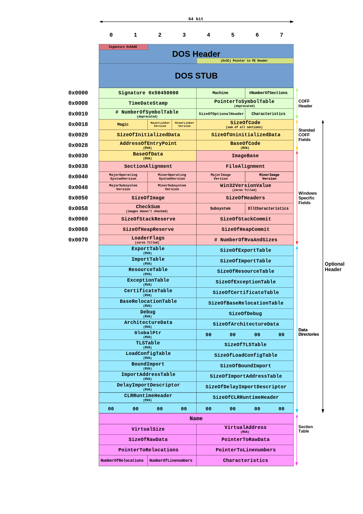

1. relocate
1. fix imports
1. execute TLS callbacks
1. call DllMain

Why relocate?
Because PE format normally contains position-dependent code, as contrast to position-indepent code. This basically means the code has to be placed into the correct virtual memory address in order to have the code working properly, otherwise when the code access the virtual memory address of some data it assumes there, it is not.

So the delta between the prefered address and the actual address is calculated, and then added to the exising memory addresses as needed.

`SizeOfBlock`
> The size of this structure plus all the WORD relocations that follow. To determine the number of relocations in this block, subtract the size of an IMAGE_BASE_RELOCATION (8 bytes) from the value of this field, and then divide by 2 (the size of a WORD). For example, if this field contains 44, there are 18 relocations that immediately follow: (44 - sizeof(IMAGE_BASE_RELOCATION)) / sizeof(WORD) = 18

## reference
- [Peering Inside the PE: A Tour of the Win32 Portable Executable File Format](https://docs.microsoft.com/en-us/previous-versions/ms809762(v=msdn.10))

- [Thread Local Storage - The C++ Way](https://www.codeproject.com/Articles/8113/Thread-Local-Storage-The-C-Way)

- [Portable Executable](https://en.wikipedia.org/wiki/Portable_Executable)

https://www.google.com/search?q=OriginalFirstThunk&rlz=1C1CHBF_enUS856US856&oq=OriginalFirstThunk&aqs=chrome..69i57.3228j0j1&sourceid=chrome&ie=UTF-8